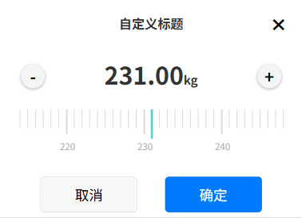

# 🎚️ ElkCalibrate - 高度可定制的移动端校准器组件



ElkCalibrate是一个专为移动端设计的强大校准器组件，提供精确的数值选择功能。支持滚动选择与步进控制双模式，拥有丰富的定制选项，适用于个人信息(身高/体重)、健康医疗、电商、工业控制等等多种场景。

## ✨ 特性

- **双模式交互**：滚动选择 + 步进按钮
- **高度可定制**：刻度颜色、精度、按钮样式等全面开放
- **响应式设计**：完美适配各种移动设备
- **无障碍支持**：完整ARIA属性
- **多场景预设**：内置常用配置模板
- **轻量高性能**：优化渲染性能，流畅体验

## 📦 安装

```bash
npm i calibrate-scale
```

```javascript
// 项目中使用
//（建议直接复制src\components\elk-calibrate\elk-calibrate.vue使用）
import ElkCalibrate from '@elk/calibrate'
import '@elk/calibrate/dist/style.css'
```

// app中

## 🚀 快速开始

```vue
<template>
  <button @click="showCalibrate = true">打开校准器</button>
  
  <ElkCalibrate
    v-model="showCalibrate"
    title="选择体重"
    :defaultValue="65.5"
    unit="kg"
    :precision="1"
    :step="0.5"
    @confirm="handleConfirm"
  />
</template>

<script setup>
import { ref } from 'vue'
import ElkCalibrate from '@elk/calibrate'

const showCalibrate = ref(false)

const handleConfirm = (value) => {
  console.log(`选择的值: ${value}`)
}
</script>
```

## 🔧 属性说明

| 属性名 | 类型 | 默认值 | 说明 |
|--------|------|---------|------|
| modelValue | Boolean | false | 控制组件显示/隐藏 |
| title | String | '编辑' | 标题文本 |
| defaultValue | Number | 0 | 默认值 |
| unit | String | 'cm' | 单位 |
| scaleNum | Number | 330 | 刻度总数 |
| step | Number | 1 | 步进值 |
| showStep | Boolean | true | 是否显示步进按钮 |
| scaleColor | String | '#D9D9D9' | 普通刻度线颜色 |
| majorScaleColor | String | '#D9D9D9' | 主刻度线颜色 |
| middleLineColor | String | '#22c1b1' | 中线颜色 |
| disabled | Boolean | false | 是否禁用交互 |
| precision | Number | 1 | 小数精度 (0-2) |
| cancelText | String | '取消' | 取消按钮文本 |
| confirmText | String | '确定' | 确定按钮文本 |
| cancelButtonStyle | Object/String | {} | 取消按钮样式 |
| confirmButtonStyle | Object/String | {} | 确定按钮样式 |
| cancelButtonClass | String | '' | 取消按钮类名 |
| confirmButtonClass | String | '' | 确定按钮类名 |
| showCloseBtn | Boolean | true | 是否显示关闭按钮 |
| showTitle | Boolean | true | 是否显示标题 |

## 📡 事件

| 事件名 | 说明 | 参数 |
|--------|------|------|
| update:modelValue | 显示状态变更时触发 | 新的显示状态 (Boolean) |
| hide | 组件隐藏时触发 | - |
| confirm | 点击确定按钮时触发 | 当前值 (String) |

## 💡 使用场景

### 健康医疗应用
```vue
<ElkCalibrate
  title="血压测量"
  :defaultValue="120"
  unit="mmHg"
  :precision="0"
  :scaleNum="300"
  :majorScaleColor="systolic > 140 ? '#F44336' : '#4CAF50'"
/>
```

### 电商价格筛选
```vue
<ElkCalibrate
  title="价格区间"
  :defaultValue="2500"
  unit="元"
  :step="100"
  :scaleNum="10000"
  scaleColor="#FF9800"
  confirmText="应用筛选"
/>
```

### 工业控制面板
```vue
<ElkCalibrate
  title="温度设置"
  :defaultValue="25.5"
  unit="℃"
  :precision="2"
  :step="0.1"
  :disabled="isMonitoring"
  middleLineColor="#0288D1"
/>
```

## 🎨 主题定制

### 自定义颜色
```vue
<ElkCalibrate
  scaleColor="#FF9800"
  majorScaleColor="#F44336"
  middleLineColor="#4CAF50"
/>
```

### 自定义按钮样式
```vue
<ElkCalibrate
  :cancelButtonStyle="{ 
    background: '#f8f8f8', 
    border: '1px solid #eee',
    borderRadius: '20px'
  }"
  :confirmButtonStyle="{
    background: 'linear-gradient(90deg, #FF9800, #F44336)',
    color: 'white'
  }"
  cancelButtonClass="custom-cancel"
  confirmButtonClass="custom-confirm"
/>
```

## 📱 兼容性

| 平台 | 兼容性 | 备注 |
|------|--------|------|
| 微信小程序 | ❌ 暂未添加 | 后续加上 |
| H5 | ✅ 支持 | 可使用 |
| App (Vue) | ✅ 完全支持 | 支持原生动画 |

## 🤝 贡献指南

欢迎贡献代码！请遵循以下步骤：

1. Fork 项目仓库
2. 创建特性分支 (`git checkout -b feature/AmazingFeature`)
3. 提交更改 (`git commit -m 'Add some AmazingFeature'`)
4. 推送到分支 (`git push origin feature/AmazingFeature`)
5. 提交 Pull Request

## 📜 许可证

本项目采用 [MIT 许可证](LICENSE)

## 🌐 资源

- [官方文档](https://elk-calibrate-docs.netlify.app)
- [示例项目](https://github.com/elk-team/calibrate-examples)
- [问题反馈](https://github.com/elk-team/calibrate/issues)

---

**让数值选择成为一种享受！** 🎉 使用ElkCalibrate提升您的移动应用体验。